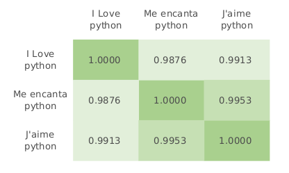
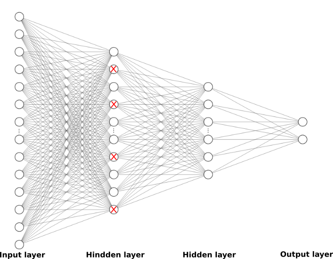
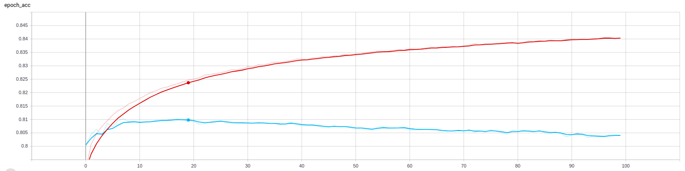

# Multi-Language Sentiment Classifier 

Can we train a sentiment classifier only using an English dataset and Google's Multi-language sentence encoder that works for the 16 supported languages?

In this piece, I'll show how to fo it in just a few Python lines! I'll go into more detail about what sentiment analysis is, why it's important and some business applications.


# Why should I care?
Sentiment analysis is the understanding and interpretation of polarity emotion (Positive, Negative and Neutral) in text using Natural Language Processing (NLP) techniques. There are sentiment modules that detect the polarity in full documents, paragraphs, sentence or word level. Sentiment analysis is an extremely useful and powerful tool that allows to quickly understand people's opinions and attitudes to react accordingly to the situation, some examples of how it can be useful for:


* Social media monitoring: The Obama administration used sentiment analysis to gauge public opinion to do policy announcements in his presidential election.
* Market research: Multiple companies track user's experiences about their products or services.
* Stock market: It has been proved that multiple stock prices, such as Bitcoin, are strongly correlated with social options.

# Multi-language Sentence Classifier.
While there are a lot of resources that show how to train a sentiment model in English, there are very few that describe the process for other languages. 

The task can become even harder due to the lack of corpora in languages other than English.

One of the most common approaches is to use translation to convert the rest of the languages. For example, you can train a sentiment model on an English dataset (because it's the language with more hight quality datasets) and then translate the non-English documents to compute the sentiment using your English model.  

Another approach is to use sentiment lexicon translated into multiple languages. 

We propose to do something slightly different to these two approaches.


# Google Multi-language Sentence encoder
Before we start, I'll give a quick overview of the main methodology used for this classifier.

The Google Universal Sentence Encoder Multilingual QA module is an extension of the Universal Sentence Encoder. 

The idea of the module is to generate a 512-dimensional vector representation for each sentence, where similar sentences have a similar vector representation regardless of the language. The model was developed for question-answering systems. But since we are only interested in the vector representation, we'll only use the encoder part of the seq2seq model.


```python
import tensorflow as tf
import tensorflow_hub as hub
import numpy as np
import tensorflow_text
from sklearn.metrics.pairwise import cosine_similarity
from sklearn.metrics import f1_score, recall_score, accuracy_score
import pickle
import pandas as pd
```


```python
# Load the pretrain model
module = hub.load('https://tfhub.dev/google/universal-sentence-encoder-multilingual-qa/2')
```


```python
input_sentences = ["I Love python", "Me encanta python", "J'aime python"]

enconder_embeddings = module.signatures['question_encoder'](
            tf.constant(input_sentences))["outputs"]
```


```python
cosine_similarity(enconder_embeddings)
```



In the above figure, we verified the performance of the model to generalize sentences in multiple languages, which is very good. Therefore, we can make the following hypothesis. Can we train a sentiment classifier only using an English dataset and Google's Multi-language Sentence Encoder (MSE) that works for the 16 supported languages?

# Multi-language sentence Classifier
## Dataset
First of all, we need a Sentiment dataset, but since it is a very study field in the NLP we have many alternatives. I'll use Sentiment140(http://help.sentiment140.com/) which is a compilation of 1.6 million tweets with Positive and  Negative tags.


```python
header_list = ["Tag", "id", "Date","Query","Author","Tweet"]
sentiment_dataset = pd.read_csv('path_to_Sentimen140/training.1600000.processed.noemoticon.csv',
                                encoding = "ISO-8859-1",
                                names = header_list)
```


```python
sentiment_dataset.head()
```

One of the most important pre-processing tasks for any machine learning model is to balance the dataset. Luckily for us, the Sentiment140 dataset is perfectly balanced.


```python
sentiment_dataset['Tag'].hist()
#0-> negative, 4 -> positive
```

# Sentence embedding generation
The second step is to compute the sentence embedding representation using the MSE. So we can use them as input for our classifier. 

We are going to compute them in batches to prevent filling the RAM. You can increase or decrease the batch size depending on your RAM.

Computing the sentence embedding might take some time depending on your hardware specifications. Therefore I recommend saving them into a pickle file in case you want to use them later for other experiments


```python
def sentences_vectors(sentences, batch: int = 500):
        """
        Compute the sentence embedding in batches to make it memory
        efficient.
        :param sentences: iterable of strings
        :param batch: batches size to compute the embeddings.The smaller
        the longer it takes.
        :return:  numpy nmatrix  of shape (X,512)
        """

        lower = 0
        upper = batch
        sent_vectors = module.signatures['question_encoder'](
            tf.constant(sentences[lower:upper]))["outputs"]
        while upper < len(sentences):
            lower += batch
            upper += batch
            print(lower)
            if sentences:
                sent_vectors = np.concatenate(
                    (sent_vectors, module.signatures['question_encoder'](
            tf.constant(sentences[lower:upper]))["outputs"]))
        return sent_vectors
```


```python
sentences_embeddings = sentences_vectors(sentiment_dataset['Tweet'].to_list())
```


```python
# Save model
with open('embedding_vectors.m','wb') as file:
    pickle.dump(sentences_embeddings,file)
```


```python
# Load sentence embeddings
with open('embedding_vectors.m','rb') as file:
    sentences_embeddings = pickle.load(file)
```

# Split Train and Test


```python
# Convert sentiment class one hot encondign
def sentiment_encode (sentiments:list)-> np.array:
    #sentiment_dict = {'positive':0, 'negative':1}
    sentiment_dict = {0:0, 4:1} # 0->negative, 4-> positive
    one_hot = np.zeros([len(sentiments),len(sentiment_dict)],dtype=int)
    for index,emotion in enumerate(sentiments):
        one_hot[index][sentiment_dict[emotion]] = 1
    return one_hot
```


```python
target_sentiment = sentiment_encode(sentiment_dataset['Tag'].to_list())
```


```python
from sklearn.model_selection import train_test_split
X_train, X_test, y_train, y_test = train_test_split(sentences_embeddings,
                                                    target_sentiment,
                                                    test_size=0.30)
```

# Train a Neural model 
We are going to use a simple Neural Network as a classifier using Keras library. 

The Neural Network model has 4 layers fully connected, the input layer has the 512 dimensions to fit the embedding representation for each sentence. The second layer has 256 neurons with a Dropout function of 0.3 to avoid overfitting, the third layer has 128 neurons, and finally, the last layer has only 2 neurons for the positive and negative class.




```python
from keras.models import Sequential
from keras.layers import Dense,Embedding,Flatten,Dropout
from keras.utils import to_categorical
import keras
```


```python
input_dim= len(X_train[0])
output_dim = len(y_train[0])
print(input_dim,output_dim)
```


```python
nn_model = Sequential()
nn_model.add(Dense(256,input_dim = input_dim, activation = 'relu'))
nn_model.add(Dropout(.3))
nn_model.add(Dense(128, activation = 'relu'))
nn_model.add(Dense(output_dim, activation='softmax'))
```


```python
# tensorboard
tbCallBack = keras.callbacks.TensorBoard(log_dir='./Grapsh/1.6_M', 
                                         histogram_freq=0, 
                                         write_graph=True, 
                                         write_images=True)
```


```python
nn_model.compile(optimizer='adam', loss='categorical_crossentropy', metrics=['acc'])
nn_model.summary()

nn_model.fit(X_train,
             y_train,
             epochs=100,
             validation_data=(X_test, y_test),
             validation_split=0.05,
             callbacks=[tbCallBack])
```


Using tensowrboard we can observe in a friendly way the accuracy of the model while training (red line training acc and blue validation acc). The model only needs to be trained for only 20 epochs because the model begins to overfit after it. This occurs when the training acc increase but the validation decrease.


```python
# Save neural network classifier
with open('sentiment_classifier.m','wb') as file:
    pickle.dump(nn_model,file)
```


```python
# Load neural network classifier
with open('sentiment_classifier.m','rb') as file:
    nn_model = pickle.load(file)
```

# Testing
The final step is to evaluate the performance of the model using some evaluation metrics.

For English, we  use the remaining 30% of the full dataset we split before.

For other languages, you will need to collect small datasets and manually tag the sentences. (Not everything in NLP is having fun while building models :)) 
 

The test on Spanish and French gives results very similar to the English ones.
 

If you want to evaluate the model in a single sentence to verify the performance you can do it as follows:


```python
preditions = nn_model.predict_classes(X_test)
```


```python
y_test_labels = np.argmax(y_test, axis = 1)
```


```python
print('acc: '+str(accuracy_score(y_test_labels,preditions)))
print('recall: '+str(recall_score(y_test_labels,preditions,average='weighted')))
print('fscore: '+str(f1_score(y_test_labels,preditions,average='weighted')))
```

If you want to evalate the model in a single sentence to verify the perfomance you can do it as follow:

PS. I classifier the sentence as Neutral if the if the probablity score of Positive or Negative are < 0.7


```python
def sentiment (s_setence: str)-> str:
    s_vector = sentences_vectors([s_setence])
    s_prediction = nn_model.predict_classes(s_vector.numpy())
    s_prob = nn_model.predict_proba(s_vector.numpy())
    decode = {1: 'positive', 0:'negative'} 
    sentiment= decode[s_prediction[0]] if s_prob.max() >= 0.7 else 'neutral'
    return sentiment
```


```python
sentiment("I love my phone")
```


```python
sentiment("El coronavirus es una nueva enfermedad")
```


```python
sentiment ("J'aime le traitement du langage naturel")
```


